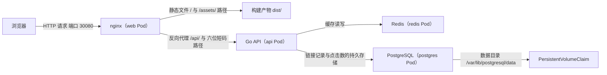

# shortener · 短链接服务（Go + Vue + PostgreSQL + Redis）

> 建立日期：2026-09-27（第 3 周）。
> 建立原因：`plan/week3/任务明细.md` 的原定实验形式是「逐个对象做对照实验」，你反馈这种形式记忆负担大、缺少实际用途。因此把第 3 周至第 4 周的主线改为一个真实可演示的项目，把「存储持久化」「配置与密钥注入」「探针」「资源限制」「排障」这些知识点全部挂在这个项目下面，做完之后它同时是简历项目的第二阶段与第三阶段形态。
> 本文件是项目的设计文档，前端代码与后端骨架都以本文件定义的接口契约与数据模型为准；接口契约一旦冻结，前端与后端必须同时遵守，否则前后端无法对接。

---

## 1. 这个项目做什么

用户在前端页面里粘贴一个长网址，后端为这个长网址生成一个 6 位的短码，并且把它保存进 PostgreSQL。此后任何人访问 `http://<主机>/<短码>` 这个地址，都会被重定向到原始的长网址，同时这次访问被计入点击统计。

Redis 在两个位置参与工作：第一，重定向时先到 Redis 里查询长网址，只有查询未命中时才回落到 PostgreSQL，这是缓存；第二，点击次数的累加先写进 Redis 的计数器，再由后端的一个后台协程每隔若干秒把增量批量写回 PostgreSQL，这是写合并。

这两个位置的存在意义是：缓存使「Pod 数量可以横向扩展」这件事变得有意义，写合并使「Pod 被随时杀死也不会丢失点击计数」这件事可以被演示出来。也就是说，这两个位置是第 3 周「存储与资源」这个主题的演示载体，不是为了堆技术栈而加入的。

---

## 2. 系统结构



| 组件 | 技术选型 | 在集群中的工作负载形态 | 是否需要持久化 | 对外暴露方式 | 由谁编写 |
|---|---|---|---|---|---|
| 前端 | Vue 3 与 Vite，构建产物由 nginx 提供 | Deployment，副本数为 2 | 不需要，静态文件已经打进镜像 | Service 的类型为 `NodePort`，映射到宿主机端口 30080 | 由我编写，已经完成 |
| 后端 | Go 1.22 以上，HTTP 层使用 `gin` 框架，数据库驱动使用 `pgx`，缓存驱动使用 `go-redis` | Deployment，副本数为 2 | 不需要，后端本身不保存状态 | 只通过 `ClusterIP` 类型的 Service 暴露给集群内部，由 nginx 反向代理访问 | 由我给出分步指引与骨架，由你编写 |
| 数据库 | PostgreSQL 16 | StatefulSet，副本数为 1 | 需要，数据目录挂载 PersistentVolumeClaim | 只通过 Headless Service 暴露给集群内部 | 由我给出骨架与提示问题，由你填写字段 |
| 缓存 | Redis 7 | Deployment，副本数为 1 | 不需要，缓存丢失只会导致重定向时回落到数据库 | 只通过 `ClusterIP` 类型的 Service 暴露给集群内部 | 由我给出骨架与提示问题，由你填写字段 |

> 关于「数据库为什么不使用 Deployment 而使用 StatefulSet」：Deployment 创建的 Pod 名称带有随机后缀，并且被重建时名称会改变，因此它不能为数据库提供一个稳定的网络标识；StatefulSet 创建的 Pod 名称是确定的并且带有序号，重建之后名称不变，同时它可以用 `volumeClaimTemplates` 为每一个 Pod 单独申请存储。第 3 周 Day 5 与 Day 6 的主题就是这两条差异，本项目把这个主题从「演示」升级为「实际使用」。

---

## 3. 数据模型

项目只使用一张表，这样可以把注意力集中在部署与排障上，而不是分散到业务建模上。

| 列名 | 类型 | 约束 | 含义 |
|---|---|---|---|
| `code` | `varchar(16)` | 主键 | 6 位短码，字符集为 `0-9` 加上 `a-z` 加上 `A-Z`，共 62 个字符，因此可用的取值数量为 $62^6 \approx 5.7 \times 10^{10}$ |
| `url` | `text` | 非空 | 用户提交的原始长网址，长度上限由后端在入口处校验为 2048 个字符 |
| `clicks` | `bigint` | 非空，默认值为 0 | 累计点击次数，由后端把 Redis 中的增量批量写回这一列 |
| `created_at` | `timestamptz` | 非空，默认值为 `now()` | 创建时间，用于前端的列表排序 |

建表语句由后端在启动时执行，因此可以使用「允许重复执行」的形式：

```sql
CREATE TABLE IF NOT EXISTS links (
    code       varchar(16) PRIMARY KEY,
    url        text        NOT NULL,
    clicks     bigint      NOT NULL DEFAULT 0,
    created_at timestamptz NOT NULL DEFAULT now()
);

CREATE INDEX IF NOT EXISTS links_created_at_idx ON links (created_at DESC);
```

> 补充说明：在真实的项目里，数据库结构的变更由独立的迁移工具负责，例如 `golang-migrate` 或者 `goose`。本项目把建表语句放在后端启动流程里执行，是刻意的简化，好处是部署顺序不再需要人为编排，代价是它不适合多人同时修改表结构的场景。你在面试时需要把这条简化的事实讲清楚，不要把它描述成标准做法。

---

## 4. 接口契约（前后端共同遵守）

所有接口的前缀都是 `/api`，请求体与响应体的字符编码都是 UTF-8，`Content-Type` 都是 `application/json`。

| 方法 | 路径 | 请求体 | 成功响应 | 说明 |
|---|---|---|---|---|
| `GET` | `/api/healthz` | 无 | `200` 与 `{"status":"ok"}` | 存活探针的检查端点，它只证明进程还能够响应请求，因此不检查任何外部依赖 |
| `GET` | `/api/readyz` | 无 | `200` 与 `{"status":"ready","checks":{"postgres":"ok","redis":"ok"}}`；任意一个依赖不可用时返回 `503` 与 `{"status":"not ready","checks":{...}}` | 就绪探针的检查端点，它必须先确认 PostgreSQL 与 Redis 都可用，因为依赖不可用时接收流量只会产生错误响应 |
| `POST` | `/api/links` | `{"url":"https://example.com/very/long"}` | `201` 与 `{"code":"a1B2c3","url":"...","clicks":0,"createdAt":"2026-09-27T10:00:00Z"}` | 创建短链接。请求体中的 `url` 缺失、长度超过 2048 个字符，或者不以 `http://` 与 `https://` 开头时返回 `400` 与 `{"error":"..."}` |
| `GET` | `/api/links` | 无，可带查询参数 `limit`（默认 20，上限 100）与 `offset`（默认 0） | `200` 与 `{"items":[...],"total":42,"limit":20,"offset":0}` | 按创建时间倒序分页列出短链接，供前端列表使用 |
| `DELETE` | `/api/links/{code}` | 无 | `204`，响应体为空 | 删除一条短链接，同时删除 Redis 中对应的缓存键与该短链的计数键。短码不存在时返回 `404` 与 `{"error":"..."}` |
| `GET` | `/api/stats` | 无 | `200` 与 `{"links":42,"clicks":1234,"cacheHits":900,"cacheMisses":100,"cacheHitRate":0.9}` | 汇总统计，供前端顶部的统计条使用。其中 `cacheHitRate` 由 `cacheHits / (cacheHits + cacheMisses)` 计算得出，分母为 0 时返回 0 |
| `GET` | `/{code}` | 无 | `302`，响应头中的 `Location` 字段为原始长网址 | 短链跳转，由 nginx 把「路径恰好是 6 位字母数字」的请求反向代理到后端。短码不存在时返回 `404`，此时响应体是一段 HTML |

> 关于 `GET /{code}` 与前端单页应用路由的冲突：本项目的短码是固定 6 位，因此 nginx 用一条正则位置规则把形如 `^/[A-Za-z0-9]{6}$` 的请求转发给后端，其余全部路径回落到 `index.html`。这条规则写在 `web/nginx.conf` 中，你需要读懂它，因为第 4 周的 Ingress 清单要处理同一件事，区别只是把这条规则从 nginx 配置文件搬到 Ingress 的 `pathType` 与 `path` 字段上。

### 4.1 错误响应的统一结构

| 情况 | HTTP 状态码 | 响应体 |
|---|---|---|
| 请求体不是合法的 JSON | `400` | `{"error":"请求体不是合法的 JSON"}` |
| `url` 字段缺失或者为空字符串 | `400` | `{"error":"url 字段不能为空"}` |
| `url` 字段不以 `http://` 或 `https://` 开头 | `400` | `{"error":"url 字段必须以 http:// 或 https:// 开头"}` |
| `url` 字段长度超过 2048 | `400` | `{"error":"url 字段长度超过 2048"}` |
| 指定的短码在数据库中不存在 | `404` | `{"error":"短码不存在"}` |
| PostgreSQL 或 Redis 不可用，并且该请求需要访问它们 | `503` | `{"error":"依赖服务不可用"}` |
| 其他未预期的错误 | `500` | `{"error":"服务器内部错误"}` |

---

## 5. Redis 键的设计

Redis 中的全部键都由后端读写，前端不直接访问 Redis。

| 键名模式 | Redis 数据类型 | 取值内容 | 写入时机 | 生存时间 | 删除时机 |
|---|---|---|---|---|---|
| `link:{code}` | 字符串 | 原始长网址 | 重定向查询未命中数据库时回填，以及创建短链接时可选地预热 | 300 秒 | 调用删除接口时主动删除，或者到期自动删除 |
| `clicks:{code}` | 字符串（用 `INCR` 累加的整数） | 尚未写回数据库的点击增量 | 每次成功的重定向执行一次 `INCR` | 不设置 | 后台协程写回数据库并且成功之后，用 `DECRBY` 扣除已经写回的增量，或者直接删除该键 |
| `stats:cache_hits` | 字符串（用 `INCR` 累加的整数） | 缓存命中次数 | 每次查询 Redis 并且命中时执行一次 `INCR` | 不设置 | 不主动删除 |
| `stats:cache_misses` | 字符串（用 `INCR` 累加的整数） | 缓存未命中次数 | 每次查询 Redis 并且未命中时执行一次 `INCR` | 不设置 | 不主动删除 |

> 关于「为什么点击计数不直接执行 `UPDATE links SET clicks = clicks + 1`」：直接更新数据库有两种代价。第一种代价是每一次重定向都要写一次数据库，热点短链会在数据库上产生写竞争；第二种代价是重定向这个动作的响应时间从此被数据库的写入延迟绑住。使用 Redis 计数器加后台批量写回之后，重定向的响应时间只取决于 Redis，而数据库承担的是每一轮周期的固定次数写入。代价是「后端进程在批量写回之前被杀死」时，这一轮的增量会丢失，这一点正是你可以写进笔记的边界条件。

---

## 6. 目录结构与各自的责任

```text
code/shortener/
├── README.md            本文件，项目设计文档与接口契约
├── compose.yaml         本地联调：PostgreSQL 与 Redis 两个依赖服务
├── web/                 前端，由我编写，已经完成
│   ├── package.json
│   ├── vite.config.js
│   ├── index.html
│   ├── nginx.conf
│   ├── Dockerfile
│   └── src/
├── api/                 后端，由你编写
│   ├── TASKS.md             分步指引，八组任务与逐组验收
│   ├── BACKEND-OVERVIEW.md  整体结构与四条主路径
│   ├── GO-CHEATSHEET.md     Go 语法速查，十二个主题
│   └── ...                  源码与 Dockerfile
└── k8s/                 Kubernetes 清单，由你编写，指引见 k8s/README.md
```

---

## 7. 从零到部署完成的六个阶段

| 阶段 | 目标 | 完成标志 | 对应的第 3 周主题 |
|---|---|---|---|
| 1 | 用 Docker Compose 只启动 PostgreSQL 与 Redis 两个依赖服务，后端以后在宿主机上运行，直接连接这两个服务 | 执行 `docker compose up -d` 之后，`docker compose ps` 中两个服务的状态都是 `running` | 无，属于准备动作 |
| 2 | 按 `api/TASKS.md` 写完后端，在宿主机上运行它，用 `curl` 依次验证全部接口 | 创建、列表、跳转、统计四个动作都返回符合契约的结果 | 无，属于准备动作 |
| 3 | 为后端与前端各写一份 Dockerfile，然后用 Compose 把四个组件一起运行起来 | 浏览器访问 `http://localhost:8080` 能够完成创建与跳转 | 容器网络与容器间的名称解析（第 1 周已具备） |
| 4 | 把四个组件部署到 kind 集群：先写命名空间、ConfigMap、Secret 与数据库，再写后端与前端 | `kubectl get po -n shortener` 中四个组件的 Pod 全部处于 `Running` 并且 `READY` 列是 `1/1` | 配置注入、卷与 PersistentVolumeClaim、StatefulSet |
| 5 | 从集群外部访问并且验证数据持久化 | 删除 `postgres-0` 这个 Pod 之后，集群重建它，此前创建的短链接仍然能够跳转 | 持久化与 StatefulSet 的稳定标识 |
| 6 | 制造故障并且定位：镜像标签错误、探针失败、依赖地址错误、内存超限 | 每一类故障都在十分钟之内依据字段定位到原因 | 排障与资源限制 |

> 阶段 1 与阶段 2 的作用是「先把业务跑通」，这样进入集群阶段之后，任何异常都可以确定是部署问题而不是业务代码问题。这个顺序不要颠倒，否则排障时会同时面对两层未知。
