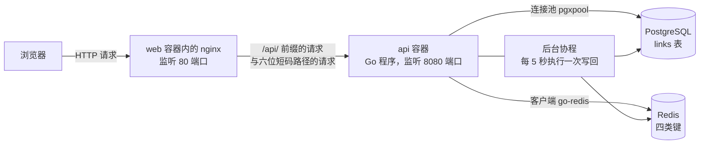
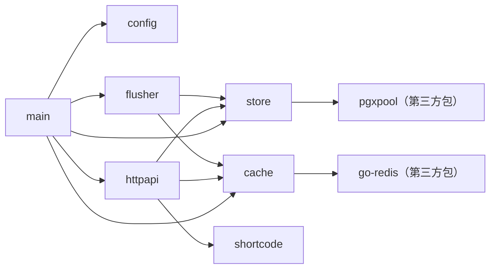

# api · 后端整体结构与组件说明

> 建立日期：2026-09-27（第 3 周）。
> 用途：在开始填写 `TASKS.md` 中的任务之前，先建立对整个后端运行方式的完整认知。
> 阅读方式：本文只讲「系统怎么运转」与「每个模块负责什么」，不讲 Go 语法。
> 遇到语法层面的疑问时，查阅同一目录下的 `GO-CHEATSHEET.md`。

---

## 1. 这个后端做什么

后端是一个 HTTP 服务，一共只提供四项能力。

| 序号 | 能力 | 对应的接口 | 数据最终存放的位置 |
|---|---|---|---|
| 1 | 把长网址换成六位短码并存起来 | `POST /api/links` | PostgreSQL 的 `links` 表 |
| 2 | 把短码换回长网址并跳转 | `GET /{code}` | 先在 Redis 中查询，未命中时回落到 PostgreSQL，并把结果回填到 Redis |
| 3 | 统计记录总数、点击总数与缓存命中率 | `GET /api/stats` | PostgreSQL 的 `links` 表与 Redis 的两个统计键 |
| 4 | 按短码删除记录 | `DELETE /api/links/{code}` | 先删除 PostgreSQL 中的记录，再删除 Redis 中的两个键 |

后端自己不保存任何数据，数据分别位于 PostgreSQL（持久存储）与 Redis（缓存与计数缓冲区）中。
因此后端进程可以被随时杀死与重建，这一点是第 4 周把副本数设置为 2 的前提。

---

## 2. 运行形态

请求分成两个方向：浏览器的请求先到达 nginx，由 nginx 决定是返回静态文件还是转发给后端；
后端处理完请求之后，分别访问 PostgreSQL 与 Redis 取得或写入数据。

需要特别注意的一点是：**后端只通过 ClusterIP 类型的 Service 暴露给集群内部，外部流量全部经过 nginx**。
因此后端的六位短码路径不需要处理单页应用的路由冲突，这个冲突由 nginx 的规则解决。
当绕过 nginx 直接访问后端端口时，任何单个路径片段都会命中跳转处理函数，
所以跳转处理函数内部必须校验短码格式，这条校验的作用就是覆盖这种情况。

---

## 3. 六个包与它们的职责边界

| 包 | 目录 | 一句话职责 | 它明确不负责什么 |
|---|---|---|---|
| `main` | `cmd/api/` | 把各个组件装配起来，启动 HTTP 服务，处理停止信号 | 不包含任何与短链接相关的业务逻辑 |
| `config` | `internal/config/` | 从环境变量读取全部可调参数，并提供默认值 | 不连接任何依赖服务，也不做参数之间的业务校验 |
| `shortcode` | `internal/shortcode/` | 生成六位短码 | 不知道数据库与 HTTP 的存在 |
| `store` | `internal/store/` | 读写 PostgreSQL 的 `links` 表 | 不做参数校验，不生成短码，不接触 Redis |
| `cache` | `internal/cache/` | 读写 Redis 的四类键 | 不知道 HTTP 的存在，也不知道数据库的结构 |
| `httpapi` | `internal/httpapi/` | 解析请求、调用 `store` 与 `cache`、写出响应 | 不直接执行 SQL，也不直接调用 Redis 命令 |
| `flusher` | `internal/flusher/` | 定时把 Redis 中的点击增量写回 PostgreSQL | 不处理 HTTP 请求 |

六个包加上第三方库之间的依赖关系如下。箭头方向表示「谁调用谁」。

图中没有任何箭头指向 `httpapi`，也就是说不存在任何模块依赖 `httpapi`。
这条性质带来两个可以直接使用的结论。

| 结论 | 具体表现 |
|---|---|
| 修改数据存储方式时只需要改动一个包 | 例如把建表语句改成使用迁移工具，只需要修改 `internal/store/postgres.go`，处理函数完全不受影响 |
| 修改对外接口时只需要改动一个包 | 例如给列表接口增加一个筛选参数，只需要修改 `internal/httpapi/handlers.go` 与契约文档，存储层完全不受影响 |

`internal/` 这个目录名本身带有编译期约束：位于 `internal/` 下面的包只能被本模块内部的代码导入，
模块之外的项目无法导入它们。这是 Go 编译器强制的规则，用来表达「这些包属于实现细节，不对外提供」。

### 3.1 HTTP 层使用的框架

HTTP 层使用 gin 框架承载，它替代了标准库 `net/http` 中与本工程相关的四件事。

| 被替代的能力 | 标准库的做法 | gin 的做法 | 本工程中的位置 |
|---|---|---|---|
| 路由注册 | `mux.HandleFunc("GET /api/healthz", 处理函数)` | `engine.GET("/api/healthz", 处理函数)` | `internal/httpapi/router.go` |
| 路由分组 | 每一条模式都要写完整路径 | `engine.Group("/api")` 之后只写前缀之后的部分 | `internal/httpapi/router.go` |
| 路径参数取值 | `r.PathValue("code")` | `c.Param("code")` | `internal/httpapi/handlers.go` |
| JSON 响应写出 | 先设置 Content-Type、再写状态码、再序列化响应体 | `c.JSON(状态码, 取值)` 一次完成 | `internal/httpapi/handlers.go` |
| 中间件 | `func(next http.Handler) http.Handler` | `func(c *gin.Context)` 配合 `c.Next()` 与 `c.Abort()` | `internal/httpapi/middleware.go` |

有三件事 gin 并不承担，仍然由 `cmd/api/main.go` 负责。它们都属于进程级的职责而不是请求级的职责，
因此保留在入口程序里：HTTP 服务的监听、四个读写超时的设置、以及收到停止信号之后的优雅退出。
gin 引擎本身实现了标准库的 `http.Handler` 接口，因此它可以直接交给 `http.Server` 使用，两者并不冲突。

另外需要记清的一点是：请求体的解析没有使用 gin 的 `c.ShouldBindJSON`，而是自己用标准库的解码器完成。
原因是接口契约要求区分「请求体不是合法的 JSON」与「url 字段缺失」两种情况，
并且各自返回固定的错误文本，而 `c.ShouldBindJSON` 会把这两类失败合并成同一个错误对象。
完整的理由写在 `internal/httpapi/handlers.go` 中 `decodeJSON` 函数的注释里。

---

## 4. 四条主路径的完整流转

理解整个系统最快的方式，是把「一次操作在系统里走了哪几步」逐条列出来。
下面四条路径覆盖了后端的全部逻辑。

### 4.1 路径 A：创建短链接

对应的接口是 `POST /api/links`，处理函数是 `httpapi.Server.handleCreateLink`。

| 步骤 | 执行者 | 输入 | 动作 | 产生的对象或状态变化 | 观察方式 |
|---|---|---|---|---|---|
| 1 | nginx | 浏览器的 `POST /api/links` 请求 | 因为路径以 `/api/` 开头，把它反向代理给上游 `api:8080` | 无 | `docker compose logs web` |
| 2 | `loggingMiddleware` 中间件 | 请求 | 记录开始时间，然后调用 `c.Next()` 继续执行后面的中间件与处理函数 | 无 | 服务日志中的请求行 |
| 3 | gin 引擎的路由树 | 请求方法与路径 | 匹配到 `POST /api/links` 这条路由，调用 `handleCreateLink` | 无 | `GIN_MODE` 取值为 debug 时启动日志中的路由清单 |
| 4 | `handleCreateLink` | 请求体 | 调用 `decodeJSON` 解析出 `{"url":"..."}`，然后逐条校验长度与协议前缀 | 无 | 400 响应的错误文本 |
| 5 | `shortcode.Generate` | 无 | 生成一个六位短码 | 无 | 响应体中的 `code` 字段 |
| 6 | `store.CreateLink` | 短码与长网址 | 执行插入语句，只写入两列 | `links` 表新增一行，`clicks` 与 `created_at` 由数据库的默认值填充 | `docker exec shortener-postgres psql -U shortener -d shortener -c 'select * from links'` |
| 7 | `handleCreateLink` | 写入结果 | 写出状态码 201 与包含四个字段的 JSON | 无 | `curl -i` 的输出 |
| 8 | `loggingMiddleware` 中间件 | 响应 | 记录请求方法、路径、状态码与耗时 | 无 | 服务日志中的请求行 |

第 6 步有两条异常分支，它们决定了本组任务的实现方式。

| 异常情况 | 数据库返回的内容 | 处理函数应当做的动作 |
|---|---|---|
| 生成的短码已经被占用 | SQLSTATE 为 `23505` 的唯一性约束冲突 | 回到第 5 步重新生成短码并重试，最多重试 5 次；超过次数返回 500 |
| 数据库不可用或者查询出错 | 其他错误 | 返回 503 与统一的错误响应体 |

### 4.2 路径 B：短码跳转

对应的接口是 `GET /{code}`，处理函数是 `httpapi.Server.handleRedirect`。
这条路径是系统的核心，也是唯一会触发缓存与点击计数的位置。

| 步骤 | 执行者 | 动作 | 缓存命中时的走向 | 缓存未命中时的走向 |
|---|---|---|---|---|
| 1 | nginx | 用正则判断路径是否恰好是六位字母或数字，是则代理给 `api:8080` | 继续 | 继续 |
| 2 | `handleRedirect` | 校验短码的长度与字符集，不满足时返回 404 | 继续 | 继续 |
| 3 | `cache.GetURL` | 读取键 `link:{code}` | 返回长网址，直接跳到第 7 步 | 返回 `cache.ErrMiss`，继续第 4 步 |
| 4 | `cache.RecordCacheResult` | 记录一次查询结果 | 让 `stats:cache_hits` 加一 | 让 `stats:cache_misses` 加一 |
| 5 | `store.GetLink` | 查询数据库 | 不执行 | 查到记录时继续；查不到时返回 404 |
| 6 | `cache.SetURL` | 回填缓存 | 不执行 | 写入键 `link:{code}`，生存时间为 300 秒 |
| 7 | `handleRedirect` | 写出跳转响应 | 302 与 `Location` 响应头 | 302 与 `Location` 响应头 |
| 8 | `cache.IncrClick` | 累加点击增量 | 让 `clicks:{code}` 加一 | 让 `clicks:{code}` 加一 |

第 7 步与第 8 步的先后顺序是刻意安排的：**先把跳转响应发出去，再累加点击计数**。
这样安排的原因是用户此时已经拿到了目标地址，第 8 步失败时只记录一条警告日志即可，
让统计丢一次比让用户看到一个错误页面更容易接受。

使用状态码 302 而不是 301 也是一项刻意的选择：301 表示永久重定向并且会被浏览器长期缓存，
之后即使数据库中的记录已经被删除，浏览器仍然会直接跳转而不再访问本服务，
删除操作对用户就失效了。

### 4.3 路径 C：后台点击写回

这条路径与 HTTP 请求无关，由 `flusher.Flusher.Run` 启动的协程按固定周期执行。

| 步骤 | 执行者 | 动作 | 产生的状态变化 | 观察方式 |
|---|---|---|---|---|
| 1 | `time.Ticker` | 每 5 秒向通道发送一个时间值 | 无 | 无 |
| 2 | `cache.CollectClicks` | 用 `SCAN` 命令枚举 `clicks:*` 键并读出每个短码的增量 | 无，这一步只读 | `docker exec shortener-redis redis-cli KEYS 'clicks:*'` |
| 3 | `store.AddClicks` | 对每个短码执行加法语句，把增量累加到数据库 | `links` 表中对应行的 `clicks` 增加 | `docker exec shortener-postgres psql -U shortener -d shortener -c 'select code, clicks from links'` |
| 4 | `cache.SubtractClicks` | 对写回成功的短码执行减法命令 | Redis 中的增量减少；减到 0 之后键仍然存在但取值为 0 | `docker exec shortener-redis redis-cli GET clicks:<code>` |

第 3 步与第 4 步的顺序不能颠倒。先扣减再写数据库时，一旦数据库更新失败，被扣掉的增量就永久丢失了；
而当前的顺序最多只会造成重复写回，代价是数据库中的计数偏高一次。

第 2 步之所以必须使用 `SCAN` 而不能使用 `KEYS`，原因是 `KEYS` 会在一次调用中遍历整个键空间，
遍历期间阻塞其他命令的执行，键的数量较多时 Redis 会停止响应。

### 4.4 路径 D：删除短链接

对应的接口是 `DELETE /api/links/{code}`，处理函数是 `httpapi.Server.handleDeleteLink`。
它的顺序是**先删除数据库记录，再删除 Redis 中的两个键**。

| 执行的顺序 | 删除失败时会发生什么 | 是否可接受 |
|---|---|---|
| 先数据库、后缓存（本项目采用） | 数据库已经删除成功，缓存删除失败，键上设有生存时间因此会自动过期 | 可接受，数据最终一致，因此只记录警告日志 |
| 先缓存、后数据库 | 缓存已经被清空，数据库删除失败，后续请求回落到数据库并把记录重新填充进缓存 | 不可接受，表现为删除操作看起来没有生效 |

---

## 5. 接口契约与代码位置的对应关系

| 接口 | 处理函数 | 需要调用的下层方法 |
|---|---|---|
| `GET /api/healthz` | `handleHealthz`（已写好） | 无。它刻意不检查任何依赖 |
| `GET /api/readyz` | `handleReadyz` | `store.Ping`（已写好）、`cache.Ping`（已写好） |
| `POST /api/links` | `handleCreateLink` | `shortcode.Generate`、`store.CreateLink` |
| `GET /api/links` | `handleListLinks` | `store.ListLinks`、`store.CountLinks` |
| `DELETE /api/links/{code}` | `handleDeleteLink` | `store.DeleteLink`、`cache.DeleteLink` |
| `GET /api/stats` | `handleStats` | `store.CountLinks`、`store.SumClicks`、`cache.CacheStats` |
| `GET /{code}` | `handleRedirect` | `cache.GetURL`、`cache.SetURL`、`cache.IncrClick`、`cache.RecordCacheResult`、`store.GetLink` |

---

## 6. Redis 中四类键的读写方

| 键名模式 | 数据类型 | 写入方 | 读取方 | 生存时间 |
|---|---|---|---|---|
| `link:{code}` | 字符串 | `cache.SetURL`，在跳转回填时写入 | `cache.GetURL` | 300 秒，由环境变量 `CACHE_TTL` 决定 |
| `clicks:{code}` | 字符串，用自增命令累加 | `cache.IncrClick` | `cache.CollectClicks`，由写回协程调用 | 不设置，由写回协程的减法命令归零 |
| `stats:cache_hits` | 字符串，用自增命令累加 | `cache.RecordCacheResult` | `cache.CacheStats` | 不设置 |
| `stats:cache_misses` | 字符串，用自增命令累加 | `cache.RecordCacheResult` | `cache.CacheStats` | 不设置 |

两个统计键不设置生存时间，因此 Redis 在没有开启持久化的情况下重启之后它们会被清零，
统计接口返回的命中率会从零开始重新累计，这一点是需要写进笔记的边界条件。

---

## 7. 当前完成状态

| 分类 | 内容 | 状态 |
|---|---|---|
| 基础设施 | 环境变量解析、连接池与客户端创建、建表语句、基于 gin 的路由注册与中间件挂载、请求日志与 panic 恢复两个中间件、请求体解析与错误响应写出辅助函数、`main` 的装配与优雅退出、`GET /api/healthz`、全部响应结构体与转换函数 | 已经写好，并且经过实际验证：编译通过、静态检查通过、路由测试全部通过、服务可以启动、数据表可以自动创建 |
| 业务逻辑 | 短码生成 1 个函数、存储层 7 个方法、缓存层 8 个方法、处理函数 6 个、后台写回 2 个方法，合计 24 个函数 | 尚未实现。未实现的函数返回 HTTP 状态码 501，错误文本中标明所属的任务分组 |

---

## 8. 建议的阅读顺序

按下面的顺序读代码，每一步只依赖前面已经读过的内容。

| 顺序 | 读什么 | 读的时候需要回答的问题 |
|---|---|---|
| 1 | `TASKS.md` 的 0.1 节与 0.3 节两张表 | 这个工程里哪些已经写好、哪些需要我实现；任务一共分成几组 |
| 2 | `internal/config/config.go` | 一个「从环境变量读取配置」的包长什么样；三个辅助函数为什么要按类型分开写 |
| 3 | `internal/shortcode/shortcode.go` 与 `shortcode_test.go` | 待实现的函数长什么样；测试从哪四个角度验证它 |
| 4 | `internal/store/postgres.go` | 七个方法的注释各自要求什么；`ErrNotFound` 为什么必须存在 |
| 5 | `internal/cache/redis.go` | 八个方法的注释各自要求什么；`ErrMiss` 与 `ErrNotFound` 的对应关系 |
| 6 | `internal/httpapi/router.go` 与 `internal/httpapi/middleware.go` | 七条路由分别对应哪一个处理函数；两个中间件各自解决什么问题 |
| 7 | `internal/httpapi/handlers.go` | 六个待实现的处理函数分别对应契约中的哪一段；辅助函数已经提供了哪些能力 |
| 8 | `internal/flusher/flusher.go` | 写回循环的三个步骤与它们之间的顺序约束 |
| 9 | `cmd/api/main.go` | 装配的顺序、启动超时的作用、优雅退出的完整过程 |

第 2 步到第 5 步讲的是「数据怎么进出系统」，第 6 步到第 9 步讲的是「请求怎么进出系统」。
这九步读完，整个后端就不存在未知的部分了。

另外可以执行 `go test ./internal/httpapi/... -v` 观察路由测试的十三个用例（四个测试函数，其中一个是九条子用例），
它们可以看作路由行为的可执行说明：每一条用例都写明了一个请求应当返回哪一个状态码。
