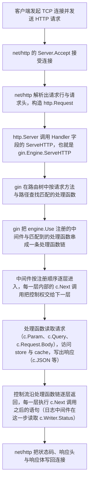

# gin 用法完整示例

> 这份文档面向「已经忘掉 gin 用法、需要重新看懂一遍」的场景。
> 文档中的示例程序与短链接项目没有直接关系，它的作用是把 gin 处理一次请求的完整流程、
> 全部常用 API 以及本项目对它们的实际使用位置一次讲清。
> 与标准库 `net/http` 的逐项对照见 `GO-CHEATSHEET.md` 第 13 节，本文档第 4 节只做摘要。

---

## 1. 一次请求在 gin 中的完整流转

gin 本身不是 HTTP 服务器，它只是一个实现了标准库 `http.Handler` 接口的**路由器与中间件容器**。
真正的网络监听、连接管理与响应写出仍然由标准库 `net/http` 承担。这一点决定了整个流程的起点与终点。



| 阶段 | 执行者 | 输入 | 动作 | 观察方式 |
|---|---|---|---|---|
| 1 | 客户端 | 长网址或者 `curl` 命令 | 客户端建立 TCP 连接并且发送请求行与请求头 | 无 |
| 2 | `net/http` 的 `http.Server` | TCP 连接 | 接受连接、解析请求行与请求头、构造 `http.Request` | 服务日志中的请求记录 |
| 3 | `net/http` 的 `http.Server` | `http.Request` | 调用 `Handler` 字段的 `ServeHTTP` 方法。本项目的 `Handler` 字段接收的是 `engine`，因为 `*gin.Engine` 拥有 `ServeHTTP` 方法，因此它自动满足 `http.Handler` 接口 | `cmd/api/main.go` 中 `http.Server` 的构造语句 |
| 4 | `gin.Engine` | 请求方法与路径 | 在路由树中查找匹配的处理函数 | `GIN_MODE` 取值为 `debug` 时启动日志中的 `[GIN-debug]` 路由清单 |
| 5 | `gin.Engine` | 匹配到的处理函数 | 把 `engine.Use` 注册的中间件与匹配到的处理函数串成一条处理函数链，链的顺序是「日志中间件 → panic 恢复中间件 → 处理函数」 | `internal/httpapi/router.go` 中 `engine.Use` 的调用语句 |
| 6 | 中间件 | `*gin.Context` | 逐层进入。每一层内部的 `c.Next()` 调用把控制权交给下一层，返回之后继续执行 `c.Next()` 之后的语句 | 第 2.3 节的「中间件与控制流」小节 |
| 7 | 处理函数 | `*gin.Context` | 读取请求参数与请求体、访问 `store` 与 `cache`、写出响应 | 处理函数内部的 `c.Param`、`c.JSON` 等调用 |
| 8 | 中间件 | 已经写出的响应 | 控制流沿链逐层返回。日志中间件在 `c.Next()` 之后读取 `c.Writer.Status()` 与 `c.Writer.Written()`，因此它记录的是真实状态码而不是默认取值 | 服务日志中的 `状态码` 字段 |
| 9 | `net/http` 的 `http.Server` | 已经写出的响应 | 把状态码、响应头与响应体写回连接 | `curl -i` 的输出 |

关于第 5 阶段有一处需要记住的机制：中间件链的进入顺序与返回顺序相反，因此它被称为洋葱模型。
日志中间件注册在最外层，它的 `c.Next()` 调用之前的语句在所有处理开始之前执行，
`c.Next()` 调用之后的语句在所有处理结束之后执行，这正是它能够记录最终状态码的原因。

---

## 2. 完整可运行示例

### 2.1 运行步骤

示例是一个只依赖 gin 的独立程序，它把数据放在内存里，因此运行它不需要 PostgreSQL 与 Redis。
把它保存成单独的一个文件，然后执行下表的命令即可。

| 步骤 | 命令 | 说明 |
|---|---|---|
| 1 | `mkdir -p /tmp/gin_demo && cd /tmp/gin_demo` | 在临时目录中建立示例工程，避免影响短链接项目的构建范围 |
| 2 | 把第 2.2 节的完整代码保存为 `/tmp/gin_demo/main.go` | 示例使用 `package main`，可以单独编译 |
| 3 | `export GOPROXY=https://goproxy.cn,direct` | 这台机器上 `proxy.golang.org` 不可达，下载依赖必须走镜像 |
| 4 | `go mod init gin_demo` | 生成 `go.mod` |
| 5 | `go get github.com/gin-gonic/gin@v1.12.0` | 下载与项目相同版本的 gin |
| 6 | `go run .` | 启动示例服务，`GIN_MODE` 的默认取值是 `debug`，因此启动时会打印路由清单 |
| 7 | 在另一个终端执行第 5 节的 `curl` 命令 | 逐条观察状态码、响应头与响应体 |

### 2.2 完整代码

```go
// Package main 是 gin 的用法示例。
//
// 它演示了 gin 处理一次请求需要用到的全部能力：
// 路由分组、路径参数、查询参数、JSON 请求体解析、四种响应写出方式、
// 两个中间件以及「路径匹配但是方法不匹配」的处理。
//
// 数据存放在内存里，因此这个示例不需要任何外部依赖。
package main

import (
	"encoding/json"
	"errors"
	"log/slog"
	"net/http"
	"os"
	"strconv"
	"strings"
	"sync"
	"time"

	"github.com/gin-gonic/gin"
)

// ---------------------------------------------------------------------------
// 数据层。用内存 map 替代数据库，目的是让示例可以单独运行。
// 关键点是并发安全：gin 为每一个请求启动一个 goroutine，
// 多个请求会同时读写这个 map，因此必须加锁，否则运行时会出现数据竞争。
// ---------------------------------------------------------------------------

var errNotFound = errors.New("记录不存在")

type book struct {
	ID        int       `json:"id"`
	Title     string    `json:"title"`
	CreatedAt time.Time `json:"createdAt"`
}

type memoryStore struct {
	mu     sync.Mutex
	books  map[int]book
	nextID int
}

func newMemoryStore() *memoryStore {
	return &memoryStore{books: make(map[int]book), nextID: 1}
}

func (m *memoryStore) Insert(title string) book {
	m.mu.Lock()
	defer m.mu.Unlock()

	created := book{ID: m.nextID, Title: title, CreatedAt: time.Now().UTC()}
	m.nextID++
	m.books[created.ID] = created
	return created
}

func (m *memoryStore) Get(id int) (book, error) {
	m.mu.Lock()
	defer m.mu.Unlock()

	found, ok := m.books[id]
	if !ok {
		return book{}, errNotFound
	}
	return found, nil
}

func (m *memoryStore) List(limit int, offset int) ([]book, int) {
	m.mu.Lock()
	defer m.mu.Unlock()

	all := make([]book, 0, len(m.books))
	for id := 1; id <= m.nextID-1; id++ {
		if found, ok := m.books[id]; ok {
			all = append(all, found)
		}
	}

	total := len(all)
	if offset >= total {
		return make([]book, 0), total
	}

	end := offset + limit
	if end > total {
		end = total
	}
	return all[offset:end], total
}

func (m *memoryStore) Delete(id int) error {
	m.mu.Lock()
	defer m.mu.Unlock()

	if _, ok := m.books[id]; !ok {
		return errNotFound
	}
	delete(m.books, id)
	return nil
}

// ---------------------------------------------------------------------------
// 响应结构与请求结构。
// ---------------------------------------------------------------------------

type errorResponse struct {
	Error string `json:"error"`
}

type createBookRequest struct {
	Title string `json:"title"`
}

// ---------------------------------------------------------------------------
// Server。依赖通过字段注入，写法与项目的 httpapi.Server 一致。
// ---------------------------------------------------------------------------

type Server struct {
	store  *memoryStore
	logger *slog.Logger
}

func NewServer(store *memoryStore, logger *slog.Logger) *Server {
	return &Server{store: store, logger: logger}
}

// writeError 写出统一结构的错误响应。
// gin 的 c.JSON 会自己把 Content-Type 设置为 application/json; charset=utf-8，
// 因此这个函数不需要手写响应头。
func (s *Server) writeError(c *gin.Context, status int, message string) {
	c.JSON(status, errorResponse{Error: message})
}

// maxRequestBodyBytes 是请求体的字节数上限。
// 这里使用 http.MaxBytesReader 而不是先读 Content-Length 头部，
// 原因是 Content-Length 由客户端提供，可以被伪造，
// 而 MaxBytesReader 是在读取过程中实际达到上限时报错，因此不受客户端声明的影响。
// c.Writer 满足标准库的 http.ResponseWriter 接口，所以可以直接作为第一个参数传入。
const maxRequestBodyBytes = 64 * 1024

func decodeJSON(c *gin.Context, dst any) error {
	c.Request.Body = http.MaxBytesReader(c.Writer, c.Request.Body, maxRequestBodyBytes)
	return json.NewDecoder(c.Request.Body).Decode(dst)
}

// ---------------------------------------------------------------------------
// 中间件。gin 的中间件就是一个类型为 func(c *gin.Context) 的函数，
// 它比普通处理函数多出来的能力是可以在内部调用 c.Next() 与 c.Abort()。
// ---------------------------------------------------------------------------

// loggingMiddleware 记录每一次请求的方法、路径、状态码与耗时。
//
// 日志写在 c.Next() 之后，因为只有等其他处理全部结束之后，
// c.Writer.Status() 才包含真实状态码；如果在 c.Next() 之前记录，读到的永远是把默认取值 200。
// 这个中间件刻意不使用 defer，原因是它需要的是「处理完成之后」这个时机，
// 而 defer 提供的是「函数退出之前」这个时机，两者并不相同。
func (s *Server) loggingMiddleware() gin.HandlerFunc {
	return func(c *gin.Context) {
		start := time.Now()

		// c.Next() 把控制权交给链中的下一个处理者。
		// 下一个处理者返回之后，控制流回到这一行继续往下执行。
		c.Next()

		s.logger.Info("请求处理完成",
			"方法", c.Request.Method,
			"路径", c.Request.URL.Path,
			"状态码", c.Writer.Status(),
			"耗时", time.Since(start).String())
	}
}

// recoveryMiddleware 把处理过程中发生的 panic 转换成 500 响应，
// 避免单个请求的 panic 让整个进程退出。
func (s *Server) recoveryMiddleware() gin.HandlerFunc {
	return func(c *gin.Context) {
		// panic 发生时控制流会直接跳出当前函数，只有 defer 能保证这一段仍然被执行。
		defer func() {
			recovered := recover()
			if recovered == nil {
				return
			}

			s.logger.Error("处理请求时发生 panic", "原因", recovered)

			// 500 响应必须先写出再终止，否则 gin 会写出一个空的响应体。
			s.writeError(c, http.StatusInternalServerError, "服务器内部错误")

			// c.Abort() 把已注册在 c 上的后续处理者全部标记为不执行。
			// 漏掉这一句的后果是：c.Next() 所在的循环会继续调用链中的下一个处理者，
			// 同一个处理函数被执行两次，并且第二次写出响应时会触发
			// 「响应头已经写出」的警告，日志中会看到重复的记录。
			c.Abort()
		}()

		c.Next()
	}
}

// ---------------------------------------------------------------------------
// 处理函数。全部处理函数的签名都是 func(c *gin.Context)。
//
// 关于 context 的传递：需要访问外部资源时，把 c.Request.Context() 交给下游函数。
// 这个 context 在一次请求结束或者客户端断开连接时被取消，
// 因此下游的数据库查询与 Redis 命令会随之取消，不会在客户端已经离开之后继续占用资源。
// ---------------------------------------------------------------------------

// handleListBooks 演示查询参数的读取与校验。
func (s *Server) handleListBooks(c *gin.Context) {
	// c.DefaultQuery 在参数缺失时返回第二个参数的取值。
	// 注意查询参数的取值类型永远是字符串，需要自己用 strconv 转换。
	limitText := c.DefaultQuery("limit", "20")
	offsetText := c.DefaultQuery("offset", "0")

	limit, err := strconv.Atoi(limitText)
	if err != nil || limit < 1 || limit > 100 {
		s.writeError(c, http.StatusBadRequest, "limit 参数必须是 1 到 100 之间的整数")
		return
	}

	offset, err := strconv.Atoi(offsetText)
	if err != nil || offset < 0 {
		s.writeError(c, http.StatusBadRequest, "offset 参数必须是不小于 0 的整数")
		return
	}

	items, total := s.store.List(limit, offset)

	// gin.H 是 map[string]any 的类型别名，用于临时拼接响应结构。
	// 正式项目里应当使用具名的结构体，因为具名结构体的字段集合是固定的，
	// 而 map 可以写入任意键，容易出现拼写错误而且编译期无法发现。
	c.JSON(http.StatusOK, gin.H{
		"items":  items,
		"total":  total,
		"limit":  limit,
		"offset": offset,
	})
}

// handleCreateBook 演示 JSON 请求体的解析与 201 响应。
func (s *Server) handleCreateBook(c *gin.Context) {
	var req createBookRequest

	// 注意这里传的是 &req，因为 decodeJSON 内部调用 Decode，它要求可写的目标。
	if err := decodeJSON(c, &req); err != nil {
		s.writeError(c, http.StatusBadRequest, "请求体不是合法的 JSON")
		return
	}

	title := strings.TrimSpace(req.Title)
	if title == "" {
		s.writeError(c, http.StatusBadRequest, "title 字段不能为空")
		return
	}
	if len(title) > 100 {
		s.writeError(c, http.StatusBadRequest, "title 字段长度超过 100")
		return
	}

	created := s.store.Insert(title)

	// 创建成功使用 201 而不是 200，语义是「请求导致了一个新资源被创建」。
	c.JSON(http.StatusCreated, created)
}

// handleGetBook 演示路径参数的读取与两种错误分支的区分。
func (s *Server) handleGetBook(c *gin.Context) {
	// c.Param 的取值来自路由模式中的 :id 部分，这里的字符串 "id" 必须与路由模式一致。
	idText := c.Param("id")

	id, err := strconv.Atoi(idText)
	if err != nil {
		s.writeError(c, http.StatusBadRequest, "id 参数必须是整数")
		return
	}

	found, err := s.store.Get(id)

	// 哨兵错误用 errors.Is 判断，不要比较错误文本，
	// 因为包装之后的错误文本会带上调用链上的上下文，比较文本必然失败。
	if errors.Is(err, errNotFound) {
		s.writeError(c, http.StatusNotFound, "记录不存在")
		return
	}
	if err != nil {
		s.writeError(c, http.StatusServiceUnavailable, "依赖服务不可用")
		return
	}

	c.JSON(http.StatusOK, found)
}

// handleDeleteBook 演示 204 响应。
func (s *Server) handleDeleteBook(c *gin.Context) {
	id, err := strconv.Atoi(c.Param("id"))
	if err != nil {
		s.writeError(c, http.StatusBadRequest, "id 参数必须是整数")
		return
	}

	if err := s.store.Delete(id); err != nil {
		if errors.Is(err, errNotFound) {
			s.writeError(c, http.StatusNotFound, "记录不存在")
			return
		}
		s.writeError(c, http.StatusServiceUnavailable, "依赖服务不可用")
		return
	}

	// 204 表示「操作成功而且响应体为空」。
	// 这里必须使用 c.Status，不能使用 c.JSON(http.StatusNoContent, nil)，
	// 因为后者会写出一个内容为 null 的响应体，与「响应体为空」的语义不一致。
	c.Status(http.StatusNoContent)
}

// handleRedirect 演示 302 跳转。
func (s *Server) handleRedirect(c *gin.Context) {
	id, err := strconv.Atoi(c.Param("id"))
	if err != nil {
		s.writeError(c, http.StatusNotFound, "记录不存在")
		return
	}

	if _, err := s.store.Get(id); err != nil {
		s.writeError(c, http.StatusNotFound, "记录不存在")
		return
	}

	// c.Redirect 会同时写出状态码与 Location 响应头。
	// 使用 302 而不是 301：301 表示永久重定向，会被浏览器长期缓存，
	// 之后即使数据被删除，浏览器仍然会直接跳转而不再访问本服务。
	c.Redirect(http.StatusFound, "https://go.dev/")
}

// handleNotice 演示直接写出 HTML。
func (s *Server) handleNotice(c *gin.Context) {
	const page = `<!doctype html><html lang="zh-CN"><head><meta charset="utf-8">` +
		`<title>gin 示例</title></head><body><h1>gin 示例页面</h1></body></html>`

	// c.Data 接收响应体类型与字节切片，适用于非 JSON 的响应。
	c.Data(http.StatusOK, "text/html; charset=utf-8", []byte(page))
}

// handlePanic 演示 panic 恢复中间件。
func (s *Server) handlePanic(c *gin.Context) {
	panic("示例故意触发的 panic")
}

// ---------------------------------------------------------------------------
// 路由注册。
// ---------------------------------------------------------------------------

func (s *Server) routes() *gin.Engine {
	// gin.New 构造一个不带任何中间件的引擎。
	// gin.Default 会额外挂载它自带的日志中间件与恢复中间件，
	// 本示例自己实现了这两个中间件，因此使用 gin.New。
	engine := gin.New()

	// Use 接收可变数量的中间件，它们的执行顺序与传入顺序一致：
	// 日志中间件在最外层，panic 恢复中间件在内层，处理函数在最内层。
	// 这样排列的原因是：处理函数发生 panic 时先由内层的恢复中间件写出 500 响应，
	// 外层的日志中间件随后读到的是真实状态码。
	engine.Use(s.loggingMiddleware(), s.recoveryMiddleware())

	// HandleMethodNotAllowed 的默认取值是 false，此时「路径匹配但方法不匹配」返回 404。
	// 设为 true 之后返回 405，行为与标准库的 http.ServeMux 一致。
	engine.HandleMethodNotAllowed = true

	// 挂在引擎根上的路由。
	engine.GET("/healthz", func(c *gin.Context) {
		c.JSON(http.StatusOK, gin.H{"status": "ok"})
	})
	engine.GET("/go/:id", s.handleRedirect)
	engine.GET("/notice", s.handleNotice)
	engine.GET("/panic", s.handlePanic)

	// 路由分组。分组只影响注册时的书写长度与路径前缀，
	// 它不会建立任何运行期的作用域，也不会自动隔离中间件。
	api := engine.Group("/api")
	{
		// 同一个路径上可以按请求方法注册不同的处理函数。
		api.GET("/books", s.handleListBooks)
		api.POST("/books", s.handleCreateBook)

		// :id 匹配单个路径片段，例如 /api/books/3 中的 "3"。
		api.GET("/books/:id", s.handleGetBook)
		api.DELETE("/books/:id", s.handleDeleteBook)
	}

	return engine
}

func main() {
	// 示例把日志写到标准输出，格式与项目一致，便于对照观察。
	logger := slog.New(slog.NewTextHandler(os.Stdout, nil))
	server := NewServer(newMemoryStore(), logger)

	engine := server.routes()

	// 把 gin 引擎交给标准库的 http.Server。
	// 这样做的原因是：超时参数、优雅退出这些能力由标准库提供，
	// gin 的 engine.Run 只是一个便利函数，它无法设置超时。
	httpServer := &http.Server{
		Addr:              ":8090",
		Handler:           engine,
		ReadHeaderTimeout: 5 * time.Second,
	}

	logger.Info("示例服务开始监听", "地址", httpServer.Addr)

	if err := httpServer.ListenAndServe(); err != nil && !errors.Is(err, http.ErrServerClosed) {
		logger.Error("示例服务异常退出", "错误", err.Error())
		os.Exit(1)
	}
}
```

### 2.3 关键机制说明

#### 中间件与控制流

| API | 作用 | 漏掉时的后果 |
|---|---|---|
| `c.Next()` | 把控制权交给链中的下一个处理者；下一个处理者返回之后，控制流回到 `c.Next()` 这一行的后面继续执行 | 中间件内部的 `c.Next()` 之后的语句永远不会执行，日志中间件会记录不到任何内容 |
| `c.Abort()` | 把当前请求上剩余的待执行处理者全部标记为不执行，同时把 `c.IsAborted()` 置为真 | panic 恢复之后外层 `c.Next()` 的循环会继续调用链中的下一个处理者，同一个处理函数被执行两次 |
| `c.IsAborted()` | 判断当前请求是否已经终止 | 无 |

#### 四种响应写出方式

| 方法 | 用途 | 本项目或者示例中的使用位置 |
|---|---|---|
| `c.JSON(状态码, 取值)` | 写出 JSON 响应体，同时把 `Content-Type` 设置为 `application/json; charset=utf-8` | 全部 JSON 接口，包括 `writeError` 内部 |
| `c.Status(状态码)` | 只写状态码，响应体为空 | `handleDeleteLink` 的 204 响应 |
| `c.Redirect(状态码, 目标地址)` | 写出状态码与 `Location` 响应头 | `handleRedirect` 的 302 响应 |
| `c.Data(状态码, 响应体类型, 字节切片)` | 写出任意类型的响应体，响应体类型由第二个参数指定 | `handleRedirect` 短码不存在时写出的 HTML |

#### 读取请求的入口

| API | 读取的内容 | 本项目的使用位置 |
|---|---|---|
| `c.Param("名字")` | 路由模式中 `:名字` 匹配到的单个路径片段 | `handleRedirect` 与 `handleDeleteLink` |
| `c.Query("名字")` | 查询字符串中该名字对应的第一个取值，参数不存在时返回空字符串 | 未使用 |
| `c.DefaultQuery("名字", "默认值")` | 查询字符串中该名字对应的第一个取值，参数不存在时返回第二个参数 | `handleListLinks` |
| `c.Request.Body` | 请求体的读取器，交给 `json.NewDecoder` 解析 | `decodeJSON` |
| `c.Request.Context()` | 请求范围的 `context.Context` | 全部需要访问 `store` 与 `cache` 的处理函数 |
| `c.ClientIP()` | 客户端地址。本项目把可信代理设置为空，因此它返回 TCP 连接的对端地址 | `loggingMiddleware` 的扩展点 |
| `c.Set("键", 值)` 与 `c.Get("键")` | 在中间件与处理函数之间传递请求范围的取值 | 本项目未使用 |

---

## 3. gin 的 API 清单（按用途分组）

| 用途 | API | 签名要点 | 说明 |
|---|---|---|---|
| 创建引擎 | `gin.New()` | 返回 `*gin.Engine` | 不带任何中间件 |
| 创建引擎 | `gin.Default()` | 返回 `*gin.Engine` | 自带日志中间件与恢复中间件，两者的输出格式固定，与本项目的 `log/slog` 不一致，因此本项目不使用它 |
| 设置运行模式 | `gin.SetMode(gin.ReleaseMode)` | 接收字符串常量 | 也可以通过环境变量 `GIN_MODE` 设置；`debug` 模式会打印路由清单 |
| 挂载中间件 | `engine.Use(中间件...)` | 接收可变数量的 `gin.HandlerFunc` | 执行顺序与传入顺序一致 |
| 注册路由 | `engine.GET/POST/PUT/DELETE/PATCH/HEAD/OPTIONS(路径, 处理函数...)` | 处理函数可以是多个，它们按顺序组成该条路由专属的处理链 | 路径中可以使用 `:名字` 与 `*名字` 两种参数形式 |
| 建立分组 | `engine.Group(前缀, 中间件...)` | 返回 `*gin.RouterGroup` | 分组的第二个参数是该组专属的中间件 |
| 读取路径参数 | `c.Param(名字)` | 返回字符串 | 名字不带冒号 |
| 读取查询参数 | `c.Query(名字)`、`c.DefaultQuery(名字, 默认值)` | 返回字符串 | 类型转换由调用方用 `strconv` 完成 |
| 解析请求体 | `c.ShouldBindJSON(&目标)`、`c.BindJSON(&目标)`、手写 `json.NewDecoder` | 返回错误 | 本项目刻意使用手写解析，理由写在 `decodeJSON` 的注释里 |
| 写出 JSON | `c.JSON(状态码, 取值)` | 无返回值 | 取值可以是结构体、切片或者 `gin.H` |
| 只写状态码 | `c.Status(状态码)` | 无返回值 | 响应体为空 |
| 写出字符串 | `c.String(状态码, 格式, 参数...)` | 无返回值 | 本项目未使用 |
| 写出字节切片 | `c.Data(状态码, 响应体类型, 数据)` | 无返回值 | 用于 HTML 一类非 JSON 响应 |
| 写文件 | `c.File(路径)`、`c.FileAttachment(路径, 下载名)` | 无返回值 | 本项目未使用，前端静态资源由 nginx 提供 |
| 跳转 | `c.Redirect(状态码, 目标地址)` | 无返回值 | 会同时写出 `Location` 响应头 |
| 终止处理链 | `c.Abort()` | 无返回值 | 与 `c.Next()` 配对使用 |
| 查询响应状态 | `c.Writer.Status()`、`c.Writer.Written()`、`c.Writer.Size()` | 返回整数或者布尔值 | 用于日志中间件；`Status()` 在未写出响应时返回默认取值 200 |
| 设置响应头 | `c.Header(名字, 取值)` | 无返回值 | 必须在写出状态码之前调用 |
| 路由开关 | `engine.HandleMethodNotAllowed`、`engine.RedirectTrailingSlash`、`engine.RedirectFixedPath` | 布尔字段 | 第二个与第三个字段的默认取值是 `true`，本项目保留默认取值 |
| 可信代理 | `engine.SetTrustedProxies(列表)` | 返回错误 | 传入 `nil` 表示不信任任何代理 |

gin 的路由模式支持两种参数形式，并且不支持正则表达式，这一点与 nginx 的 `location` 规则不同。

| 形式 | 匹配范围 | 举例 | 本项目中的使用位置 |
|---|---|---|---|
| `:名字` | 恰好一个路径片段，不含 `/` | `/links/:code` 匹配 `/links/a1B2c3`，不匹配 `/links/a1B2c3/x` | `DELETE /api/links/:code` |
| `*名字` | 从该位置开始的全部剩余路径，包含 `/` | `/static/*路径` 匹配 `/static/a/b.css` | 未使用 |

---

## 4. gin 与 net/http 的对照（摘要）

| 关注点 | 标准库 `net/http` | gin |
|---|---|---|
| 处理函数签名 | `func(w http.ResponseWriter, r *http.Request)` | `func(c *gin.Context)` |
| 路径参数 | 需要使用 `http.ServeMux` 的模式匹配，或者自己解析路径 | `engine.GET("/links/:code", ...)` 配合 `c.Param("code")` |
| 查询参数 | `r.URL.Query().Get("limit")` | `c.Query("limit")`、`c.DefaultQuery("limit", "20")` |
| 方法不匹配 | `http.ServeMux` 在 Go 1.22 起支持「方法加路径」模式，方法不匹配时返回 405 | 默认返回 404；把 `engine.HandleMethodNotAllowed` 设为 `true` 之后返回 405 |
| 中间件 | 需要自己写「接收 `http.Handler` 并返回 `http.Handler`」的包装函数 | `gin.HandlerFunc` 配合 `c.Next()` 与 `c.Abort()` |
| 读取响应状态码 | `http.ResponseWriter` 只能写、不能读，必须用结构体嵌入自己包装一层 | `c.Writer.Status()` 直接读取 |
| 提交给 `http.Server` | `Handler` 字段接收实现了 `http.Handler` 的取值 | `*gin.Engine` 实现了 `ServeHTTP` 方法，因此可以直接放进 `Handler` 字段，不需要任何适配 |

---

## 5. 示例程序的验证命令与预期输出

| 动作 | 命令 | 预期结果 |
|---|---|---|
| 存活检查 | `curl -i http://localhost:8090/healthz` | 200，响应体是 `{"status":"ok"}` |
| 创建一条记录 | `curl -i -X POST http://localhost:8090/api/books -H 'Content-Type: application/json' -d '{"title":"深入理解计算机系统"}'` | 201，响应体中包含 `id`、`title`、`createdAt` 三个字段 |
| 请求体不是合法 JSON | `curl -i -X POST http://localhost:8090/api/books -H 'Content-Type: application/json' -d 'not-json'` | 400，错误文本是「请求体不是合法的 JSON」 |
| 请求体缺少必填字段 | `curl -i -X POST http://localhost:8090/api/books -H 'Content-Type: application/json' -d '{}'` | 400，错误文本是「title 字段不能为空」 |
| 读取查询参数 | `curl -i 'http://localhost:8090/api/books?limit=1&offset=0'` | 200，响应体中的 `limit` 是 1、`offset` 是 0 |
| 查询参数超出范围 | `curl -i 'http://localhost:8090/api/books?limit=101'` | 400，错误文本与 `limit` 参数的校验规则一致 |
| 读取路径参数 | `curl -i http://localhost:8090/api/books/1` | 200，响应体是这一条记录 |
| 路径参数不是整数 | `curl -i http://localhost:8090/api/books/abc` | 400，错误文本是「id 参数必须是整数」 |
| 记录不存在 | `curl -i http://localhost:8090/api/books/999` | 404，错误文本是「记录不存在」 |
| 删除一条记录 | `curl -i -X DELETE http://localhost:8090/api/books/1` | 204，响应体为空 |
| 路径匹配但方法不匹配 | `curl -i -X POST http://localhost:8090/api/books/1` | 405，响应体由 gin 生成，内容是 `405 method not allowed` |
| 跳转 | `curl -i http://localhost:8090/go/2` | 302，`Location` 响应头是 `https://go.dev/` |
| 写出 HTML | `curl -i http://localhost:8090/notice` | 200，`Content-Type` 以 `text/html` 开头 |
| panic 恢复 | `curl -i http://localhost:8090/panic` | 500，响应体是 `{"error":"服务器内部错误"}`；服务进程保持运行，日志中出现一条 `处理请求时发生 panic` |
| 观察日志 | 查看示例服务所在终端的输出 | 每一条日志都包含方法、路径、状态码与耗时，并且状态码与 `curl` 观察到的取值一致 |

---

## 6. 本项目七个处理函数与 gin API 的对应关系

| 处理函数 | 路由 | 读取请求使用的 API | 写出响应使用的 API | 特有条件 |
|---|---|---|---|---|
| `handleHealthz` | `GET /api/healthz` | 无 | `c.JSON(http.StatusOK, healthResponse{...})` | 已经写好 |
| `handleReadyz` | `GET /api/readyz` | `c.Request.Context()` | `c.JSON`（成功）或者 `c.JSON`（503） | 需要 `context.WithTimeout` 并且必须 `defer cancel()` |
| `handleCreateLink` | `POST /api/links` | `decodeJSON(c, &req)`、`c.Request.Context()` | `c.JSON(http.StatusCreated, ...)` 或者 `s.writeError` | 需要短码冲突重试循环 |
| `handleListLinks` | `GET /api/links` | `c.DefaultQuery`、`strconv.Atoi`、`c.Request.Context()` | `c.JSON(http.StatusOK, linkListResponse{...})` | 需要把字符串转成整数并校验范围 |
| `handleRedirect` | `GET /:code` | `c.Param("code")`、`c.Request.Context()` | `c.Redirect`、`c.Data`（404 的 HTML）或者 `s.writeError` | 唯一的跳转响应与唯一的 HTML 响应 |
| `handleStats` | `GET /api/stats` | `c.Request.Context()` | `c.JSON(http.StatusOK, statsResponse{...})` | 命中率的分母必须判零 |
| `handleDeleteLink` | `DELETE /api/links/:code` | `c.Param("code")`、`c.Request.Context()` | `c.Status(http.StatusNoContent)` 或者 `s.writeError` | 唯一的 204 响应；缓存删除失败只记录日志 |

`handleCreateLink` 采用「插入成功之后回读一次」的方案时，gin 相关的调用序列如下表。
表中的「回读」指的是 `s.store.GetLink` 这一次额外的查询，它存在的理由是
`store.CreateLink` 只返回 `error`，而接口契约要求 201 响应中包含数据库生成的 `createdAt` 字段。

| 序号 | 动作 | 使用的 gin API 或者下游函数 | 失败时的处理 |
|---|---|---|---|
| 1 | 解析请求体 | `decodeJSON(c, &req)` | 400 与「请求体不是合法的 JSON」 |
| 2 | 校验 `url` 字段 | 不需要 gin 的 API | 分别返回三种 400 错误文本 |
| 3 | 生成短码并且插入数据库 | `shortcode.Generate`、`s.store.CreateLink(c.Request.Context(), link)` | 冲突时重试；其余错误返回 503 |
| 4 | 回读刚才写入的记录 | `s.store.GetLink(c.Request.Context(), code)` | 返回 503 与「依赖服务不可用」 |
| 5 | 转换并写出 | `toLinkResponse`、`c.JSON(http.StatusCreated, ...)` | 无 |

关于第 4 步的取舍需要在实现之后写进笔记：回读的代价是每一次创建多一次数据库往返，
它换来的收益是响应中的 `createdAt` 与 `clicks` 与数据库中的真实取值完全一致。
替代方案是使用 `INSERT ... RETURNING` 让插入语句直接返回整行，
但那需要把 `store.CreateLink` 的签名从「返回 `error`」改成「返回记录与 `error`」，
而该函数属于第 2 组已经验收过的代码，本组不修改它。

---

## 7. 易错点与后果

| 易错点 | 后果 | 正确做法 |
|---|---|---|
| 写出响应之后没有 `return` | 后续语句继续执行并且尝试写出第二次响应，日志中出现 `headers were already written` 警告，客户端的响应状态码可能是第一次写出的取值 | 每一个错误分支在写出响应之后立即 `return` |
| 在 `recoveryMiddleware` 中漏掉 `c.Abort()` | 外层 `c.Next()` 的循环继续调用链中的下一个处理者，同一个处理函数被执行两次 | 写出 500 响应之后立即调用 `c.Abort()` |
| 使用 `c.JSON(http.StatusNoContent, nil)` 表达无响应体 | 客户端收到内容为 `null` 的响应体，与「响应体为空」的语义不一致 | 使用 `c.Status(http.StatusNoContent)` |
| 直接比较错误文本 | 包装之后的错误文本会带上调用链上的上下文，比较必然失败 | 使用 `errors.Is` 判断哨兵错误 |
| 忘记 `c.DefaultQuery` 的第二个参数 | 参数缺失时得到空字符串，`strconv.Atoi` 返回错误，接口把合法的默认请求判成 400 | 为 `limit` 提供默认值 `"20"`，为 `offset` 提供默认值 `"0"` |
| 把调用下游函数时使用的 context 写成 `context.Background()` | 客户端断开连接或者请求超时之后，数据库查询与 Redis 命令仍然继续执行 | 统一使用 `c.Request.Context()` |
| 把 `gin.Default()` 当作默认选择 | 服务输出中出现两套格式不同的日志，并且 gin 自带的恢复中间件与本项目的恢复中间件同时生效 | 使用 `gin.New()` 并且自己挂载两个中间件 |
| 在 debug 模式下运行容器 | 每一个请求都会在标准输出打印调试信息，容器日志量显著增加 | 容器中通过环境变量把 `GIN_MODE` 设置为 `release`，本项目已经写入 `api/Dockerfile` |
| 认为 `engine.Group` 会隔离中间件 | 分组只影响路径前缀的书写长度，组内路由仍然继承引擎上已挂载的中间件 | 需要组专属中间件时把它作为 `Group` 的第二个参数传入 |

---

## 8. 练习

| 序号 | 练习 | 目标 |
|---|---|---|
| 1 | 给示例的 `loggingMiddleware` 增加一个字段，记录客户端地址 `c.ClientIP()` | 熟悉 `c.Request` 与 `c.ClientIP()` |
| 2 | 给示例增加一条路由 `PUT /api/books/:id`，接收 JSON 请求体并且更新标题 | 熟悉三种请求方法注册与路径参数 |
| 3 | 把示例的 `c.JSON(http.StatusOK, gin.H{...})` 改成具名结构体 | 理解具名结构体与 `gin.H` 的取舍 |
| 4 | 删除 `recoveryMiddleware` 中的 `c.Abort()`，然后请求 `/panic` | 在日志中亲自观察同一个处理函数被执行两次的现象 |
| 5 | 把示例的 `http.Server` 换成 `engine.Run(":8090")` | 对比两种写法在超时配置能力上的差异 |
