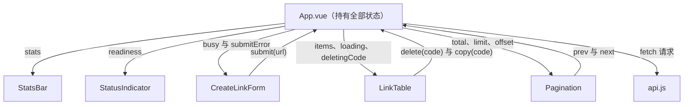

# web · 前端工程说明

> 本文件说明 `web/` 目录的每个文件承担什么责任、`nginx.conf` 的三条分流规则分别处理哪些请求，
> 以及在「本地开发」「Docker Compose」「Kubernetes」三种形态下如何运行它。
> 接口契约以 `../README.md` 第 4 节为准，本文件不重复定义接口，只说明前端如何调用这些接口。

---

## 1. 文件清单与各自的责任

| 文件或目录 | 责任 | 在哪个阶段被使用 |
|---|---|---|
| `package.json` | 声明依赖（`vue`）、开发依赖（`vite` 与 `@vitejs/plugin-vue`）以及三条 npm 脚本：`dev`、`build`、`preview` | 阶段 2 与阶段 3 之间，用于本地构建与调试 |
| `vite.config.js` | 定义开发服务器的监听地址与端口，并定义开发模式下的两条转发规则：以 `/api` 开头的请求、以及路径恰好是六位字母或数字的请求 | 本地开发与镜像构建两个场景都会读取 |
| `index.html` | 单页应用的 HTML 入口，只包含一个 `#app` 挂载节点与一条指向 `src/main.js` 的模块脚本 | 构建时由 Vite 作为入口处理 |
| `nginx.conf` | 运行阶段的分流规则：提供静态文件、代理 `/api/`、代理六位短码路径、单页应用回落 | 阶段 3 与阶段 4；容器启动时被读取 |
| `Dockerfile` | 两阶段构建：Node 阶段执行 `vite build`，nginx 阶段只复制产物与配置 | 阶段 3 |
| `.dockerignore` | 把 `node_modules` 与 `dist` 排除在构建上下文之外 | 阶段 3 |
| `src/main.js` | 创建 Vue 应用实例并挂载根组件 | 运行时 |
| `src/api.js` | 前端唯一发起 HTTP 请求的位置，函数与接口契约一一对应 | 运行时 |
| `src/App.vue` | 根组件，持有页面全部状态并且负责调用 `api.js` 中的函数 | 运行时 |
| `src/styles.css` | 全局样式与配色变量，组件内部不再写样式块 | 运行时 |
| `src/components/` | 五个展示型组件：`CreateLinkForm`、`LinkTable`、`Pagination`、`StatsBar`、`StatusIndicator` | 运行时 |

### 1.1 组件之间的数据流向

这套结构遵循单向数据流：状态只保存在 `App.vue` 中，子组件通过属性接收数据，通过事件向上报告用户的操作，
接口请求只由 `App.vue` 发起。这样做的收益是，排查「界面上的数字为什么不对」这类问题时，只需要检查一个文件。

---

## 2. nginx.conf 的三条分流规则

| 序号 | 匹配方式 | 匹配的请求 | 处理方式 | 为什么需要这条规则 |
|---|---|---|---|---|
| 规则一 | 前缀匹配 `location /api/` | 例如 `/api/links`、`/api/stats`、`/api/readyz` | 反向代理到 `http://shortener_api`，也就是主机名 `api` 的 8080 端口 | 前端与后端在运行阶段是同一个域名的不同路径，浏览器不会跨域，因此后端不需要配置 CORS 响应头 |
| 规则二 | 正则匹配 `location ~ "^/[A-Za-z0-9]{6}$"` | 例如 `/a1B2c3`、`/Zx9Yq1` | 反向代理到同一个上游；`proxy_pass` 后面不带路径，因此后端收到的原始路径仍然是 `/{code}` | 短码只有六位，与前端页面的路径不会冲突，因此可以用一条正则把这类请求全部交给后端处理 |
| 规则三 | 前缀匹配 `location /` | 除上面两类之外的全部请求 | 执行 `try_files $uri $uri/ /index.html`，也就是先找静态文件，找不到就返回单页应用的入口 | 用户直接刷新前端页面时，请求会到达 nginx，此时必须返回 `index.html`，否则会出现 404 |

### 2.1 规则匹配顺序中的一个易错点

`/assets` 这六个字符恰好满足规则二的正则表达式 `^/[A-Za-z0-9]{6}$`，
如果把规则二写在前面，那么对静态资源目录本身发起的请求会被错误地转发给后端。
本配置采用的规避手段有两条：一是给静态资源目录使用带 `^~` 修饰符的前缀规则，命中之后 nginx 不再尝试后续的正则；
二是为路径恰好是 `/assets` 的请求单独写一条精确匹配规则。这三条规则在文件中的书写顺序与上面的表格一致。

### 2.2 与第 4 周 Ingress 的对应关系

第 4 周要把这三条规则从 nginx 配置搬到 Ingress 资源上，对应关系如下表。

| nginx 中的写法 | Ingress 中的对应写法 | 需要注意的差异 |
|---|---|---|
| `location /api/` 前缀匹配 | `path: /api` 并且 `pathType: Prefix` | Ingress 的 `Prefix` 是按路径分段匹配，不会把 `/apifoo` 也匹配进去，而 nginx 的前缀匹配是纯字符串前缀 |
| `location ~ "^/[A-Za-z0-9]{6}$"` 正则匹配 | Ingress 的 `pathType` 只有 `Prefix`、`Exact`、`ImplementationSpecific` 三种，无法表达这条正则 | 因此第 4 周需要把这条规则改成「`/` 的全部请求交给前端，前端遇到未知路径时自己请求后端」，或者在 Ingress 前面再加一层 nginx |
| `try_files $uri $uri/ /index.html` | 不需要在 Ingress 中表达 | Ingress 只负责把流量交给 Service，返回哪个文件由 Pod 内部的 nginx 决定，因此这条规则会一直保留在 `web` 镜像里 |

---

## 3. 三种形态下的运行方式

### 3.1 本地开发形态（阶段 2 期间使用）

后端在宿主机上运行并且监听 8080 端口，前端使用 Vite 的开发服务器。

| 动作 | 命令 | 预期结果 |
|---|---|---|
| 安装依赖 | `npm install` | `web/` 目录下出现 `node_modules/` 与 `package-lock.json` |
| 启动开发服务器 | `npm run dev` | 终端输出本地访问地址 `http://localhost:5173` |
| 验证接口转发 | 在页面上创建一条短链接 | 浏览器开发者工具的 Network 面板中出现状态码为 201 的 `POST /api/links` 请求，其地址是 `http://localhost:5173/api/links` |

开发模式的转发规则与运行阶段的 nginx 规则一一对应，只是承载者不同，对应关系如下表。

| 开发模式下的 Vite 规则 | 运行阶段的 nginx 规则 | 作用 |
|---|---|---|
| `'/api'` 字符串键，按前缀匹配 | `location /api/` | 把接口请求转发给后端 |
| `'^/[A-Za-z0-9]{6}$'` 字符串键，以 `^` 开头因此被解释为正则表达式 | `location ~ "^/[A-Za-z0-9]{6}$"` | 把六位短码的跳转请求转发给后端，因此开发模式下也可以直接打开 `http://localhost:5173/a1B2c3` 验证跳转 |
| 无对应规则 | `location /` 与 `try_files $uri $uri/ /index.html` | 开发模式下由 Vite 自己提供源文件与单页应用回落，因此不需要额外配置 |

### 3.2 Docker Compose 形态（阶段 3 使用）

| 动作 | 命令 | 预期结果 |
|---|---|---|
| 构建并启动四个组件 | `docker compose up -d --build` | `docker compose ps` 中四个服务的状态都是 `running` |
| 访问页面 | 浏览器打开 `http://localhost:8080` | 页面正常显示，顶部的后端状态指示器显示「后端就绪」 |
| 查看 nginx 日志 | `docker compose logs -f web` | 可以看到每一次 `/api/` 请求与每一次短码请求都被记录 |

在 Compose 形态下，`web` 服务的端口映射需要写成 `"8080:80"`，也就是把宿主机的 8080 端口映射到容器的 80 端口。
这个映射关系与 Kubernetes 中「Service 把 80 端口暴露给集群内部，再由 NodePort 映射到宿主机的 30080 端口」是同一件事的两个层次。

### 3.3 Kubernetes 形态（阶段 4 与阶段 5 使用）

在集群中，`nginx.conf` 里的上游主机名 `api` 必须能够被解析，因此 Kubernetes 侧需要满足两个条件。

| 条件 | 具体要求 | 不满足时出现的现象 |
|---|---|---|
| Service 的名称必须是 `api` | 与 `web` 的 Pod 位于同一个命名空间内 | nginx 启动时报 `host not found in upstream "api"` 并且容器直接退出，Pod 状态反复在 `Running` 与 `CrashLoopBackOff` 之间切换 |
| Service 必须暴露 8080 端口 | `port: 8080` 并且 `targetPort` 指向容器实际监听的端口 | nginx 能够启动，但是访问页面时所有接口请求返回 502，`web` Pod 的日志中出现 `connect() failed` 记录 |

`web` 镜像在集群中使用时不需要做任何修改，只需要把 `web` Deployment 的容器端口声明为 80，
并且让一个 `NodePort` 类型的 Service 把 30080 映射到这个端口。

---

## 4. 构建镜像的命令与预期结果

| 动作 | 命令 | 预期结果 |
|---|---|---|
| 构建镜像 | `docker build -t shortener-web:dev ./web` | 输出以 `naming to docker.io/library/shortener-web:dev` 结尾的构建日志 |
| 查看镜像大小 | `docker images shortener-web:dev` | 最终镜像的体积在 60 MB 上下，明显小于带 `node_modules` 的单阶段镜像 |
| 检查两阶段构建是否生效 | `docker run --rm shortener-web:dev ls /usr/share/nginx/html` | 输出 `assets` 与 `index.html`，没有 `src` 与 `node_modules` |

---

## 5. 本目录中刻意保留的一处简化

`src/api.js` 中的全部请求都使用相对路径，因此前端在三种形态下都不需要修改代码，这是相对路径带来的收益。
代价是前端无法脱离反向代理直接访问后端，也就是说如果后端运行在另一个域名上，
本目录的代码需要引入一个可配置的基础地址（例如从构建时注入的环境变量读取）。
在真实项目里通常会把这个基础地址做成构建参数，本项目为了保持三种形态的代码一致而选择了相对路径这种简化形式。
